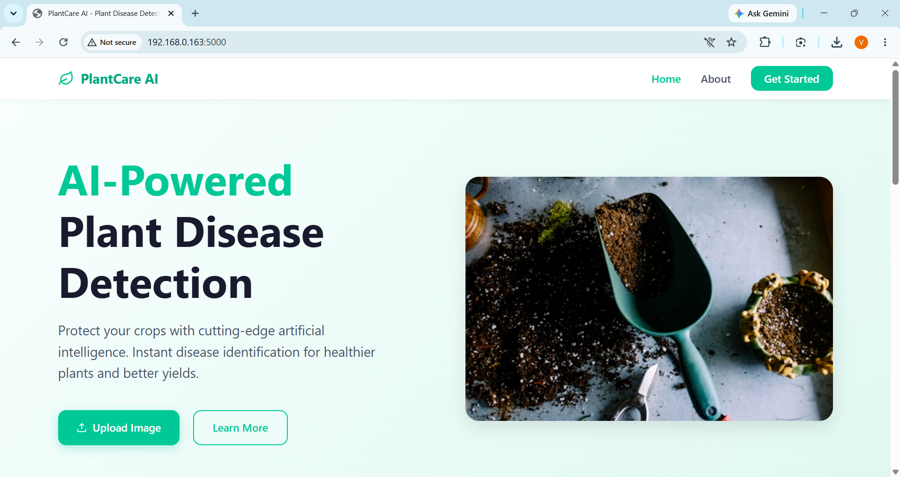
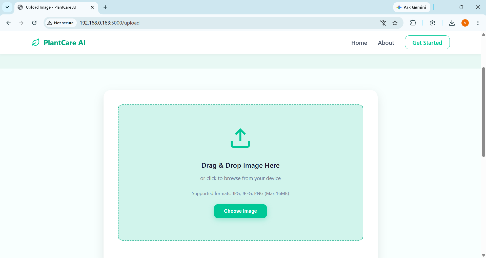
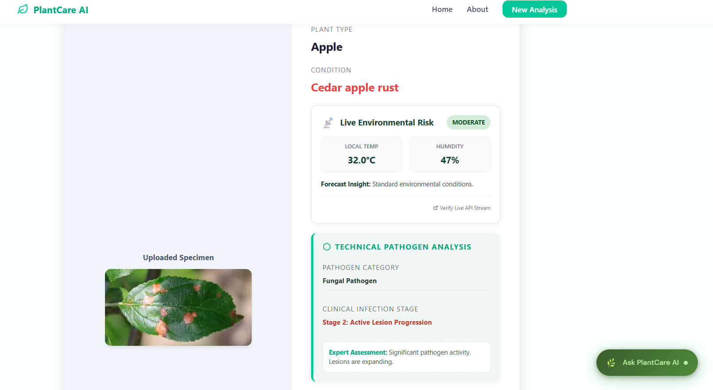
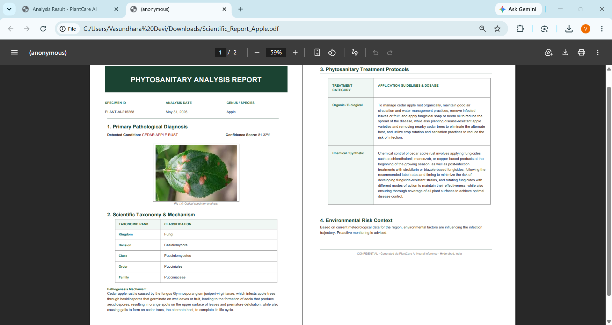
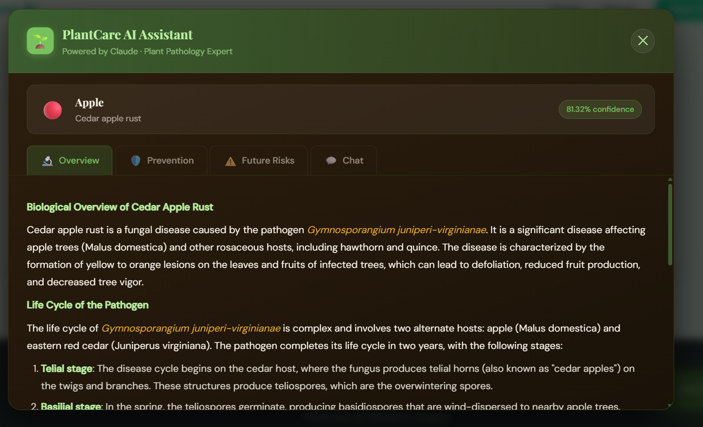

# 🌿 PlantCare AI – Intelligent Plant Disease Diagnosis System

PlantCare AI is an AI-powered plant health analysis platform that combines deep learning, real-time environmental monitoring, and automated report generation to assist in early detection and management of plant diseases.

The system uses a MobileNetV2-based image classification model trained on 38 plant disease categories and provides weather-aware risk assessments, disease analysis, treatment recommendations, and professional phytosanitary reports.

---

## 🚀 Features

### 🔍 AI Disease Detection

* Classifies 38+ plant diseases and healthy plant conditions
* Powered by MobileNetV2 deep learning architecture
* High-confidence image-based diagnosis

### 🌦️ Environmental Risk Analysis

* Real-time temperature and humidity integration
* Weather-aware disease risk forecasting
* Environmental condition monitoring

### 📊 Technical Disease Assessment

* Plant species identification
* Disease categorization
* Infection-stage interpretation
* AI confidence scoring

### 📄 Automated PDF Report Generation

* Professional phytosanitary reports
* Disease diagnosis summary
* Environmental analysis
* Recommended treatment protocols

### 🤖 PlantCare AI Chatbot

* Interactive plant health assistant
* Guidance for disease management
* Plant care recommendations

---

## 🛠️ Tech Stack

### Machine Learning

* TensorFlow
* Keras
* MobileNetV2
* NumPy

### Backend

* Python
* Flask

### Frontend

* HTML
* CSS
* JavaScript

### Additional Tools

* ReportLab (PDF generation)
* Weather API Integration

---

## 🧠 Model Information

| Attribute    | Value                        |
| ------------ | ---------------------------- |
| Architecture | MobileNetV2                  |
| Task         | Plant Disease Classification |
| Classes      | 38                           |
| Input Type   | Leaf Images                  |
| Framework    | TensorFlow / Keras           |

---

## 📸 Application Screenshots

### Home Page



### Image Upload Interface



### Disease Prediction Result



### Generated PDF Report



### AI Chatbot Assistant



---

## ⚙️ Installation

### Clone Repository

```bash
git clone https://github.com/Vasundhara117/PlantAI.git
cd PlantAI
```

### Install Dependencies

```bash
pip install -r requirements.txt
```

### Run Application

```bash
python app1.py
```

Open:

```text
http://127.0.0.1:5000
```

---

## 📈 Workflow

1. Upload a plant leaf image
2. AI model analyzes the image
3. Disease class is predicted
4. Environmental conditions are fetched
5. Risk assessment is generated
6. Recommendations are displayed
7. PDF report can be downloaded
8. User can interact with PlantCare AI chatbot

---

## 🎯 Future Improvements

* Mobile application deployment
* Multi-language support
* Real-time camera-based detection
* Disease severity estimation
* Cloud deployment
* Farmer analytics dashboard

---

## 👩‍💻 Author

**Vasundhara Devi**

Computer Science Engineering Student

GitHub: https://github.com/Vasundhara117

LinkedIn: https://www.linkedin.com/in/vasundhara-devi/
